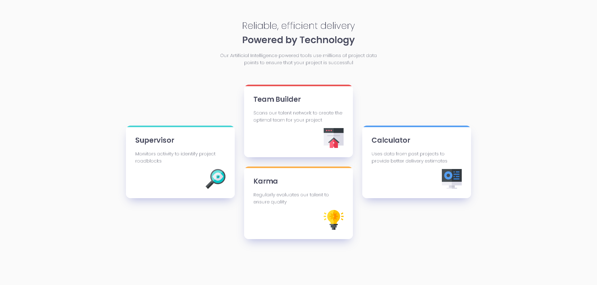

# Frontend Mentor - Four card feature section solution

This is a solution to the [Four card feature section challenge on Frontend Mentor](https://www.frontendmentor.io/challenges/four-card-feature-section-weK1eFYK). Frontend Mentor challenges help you improve your coding skills by building realistic projects. 

## Table of contents

- [Overview](#overview)
  - [The challenge](#the-challenge)
  - [Screenshot](#screenshot)
  - [Links](#links)
- [My process](#my-process)
  - [Built with](#built-with)
  - [What I learned](#what-i-learned)
  - [Useful resources](#useful-resources)
- [Author](#author)

**Note: Delete this note and update the table of contents based on what sections you keep.**

## Overview

### The challenge

Users should be able to:

- View the optimal layout for the site depending on their device's screen size

### Screenshot



### Links

- Solution URL: [Add solution URL here](https://your-solution-url.com)
- Live Site URL: [Add live site URL here](https://your-live-site-url.com)

## My process

### Built with

- Semantic HTML5 markup
- CSS custom properties
- Mobile-first workflow
- Flexbox

### What I learned

This is how I made the color lines at the top of each card.

```css
.blue {
  background: linear-gradient(180deg, var(--color-blue) 2%, white 2%);
}
.cyan {
  background: linear-gradient(180deg, var(--color-cyan) 2%, white 2%);
}
.red {
  background: linear-gradient(180deg, var(--color-red) 2%, white 2%);
}
.orange {
  background: linear-gradient(180deg, var(--color-orange) 2%, white 2%);
}
```

### Useful resources

- [How to do the top cards colored lines](https://stackoverflow.com/questions/41526420/how-to-remove-fade-from-gradient-in-css)
- [Box Shadow Generator](https://html-css-js.com/css/generator/box-shadow/) - Usefull to create shadow easily..

## Author

- Website - [Add your name here](https://www.your-site.com)
- Frontend Mentor - [@yourusername](https://www.frontendmentor.io/profile/yourusername)
- Twitter - [@yourusername](https://www.twitter.com/yourusername)
